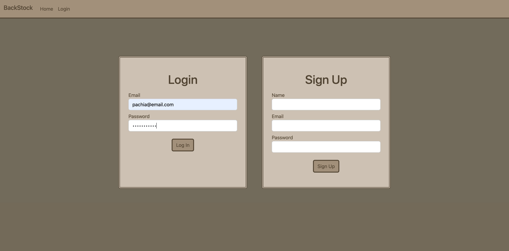
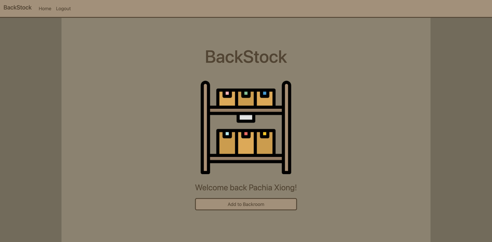
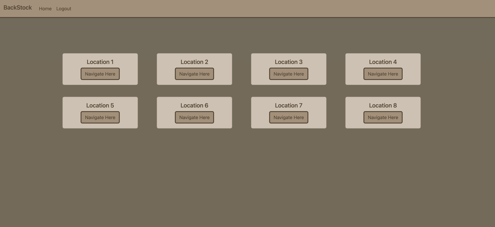
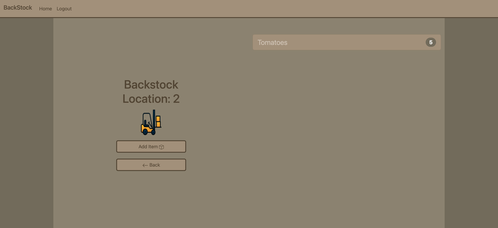

# project-2-BackStock

## Table of Contents

- [Description](#description)
- [Installation](#installation)
- [Usage](#usage)
- [License](#license)
- [Contributors](#Contributors)

## Description:

- In need of some Inventory Management? Look no further we can provide the system to keep track of your products  
- As a team, we built this project to become more familiar with building a full-stack website  
- This project helps solve problems with inventory managment by keeping your items in "virtual wackos" which can later be taken out when needed.  

## Installation

1. `git clone git@github.com:PDKetchum/project-2-BackStock.git`
2. Open `server.js`

## Usage

In terminal

1. `npm install`
2. Create `.env` file and enter mysql credentials with `DB_NAME` set as "`backstock_db`"
3. Connect to database with `mysql -u root -p`
4. `npm run seed`
5. `npm start`
6. Open `https://localhost:3001`

GitHub URL: https://github.com/PDKetchum/project-2-BackStock

Heroku URL: https://backstock-23.herokuapp.com/

## License

- N/A 

## Contributors

- WixkedLuck
- PDKetchum
- dhoffman03
- Mark55Kelly  

## Test

- N/A  

_Screenshots of page_

